# despligues-ia3

> Despliegues Algoritmos Clase

Proyecto para Master Bootcamp IA3 del módulo Despliegues MLOps

Este proyecto es un entregable para la práctica del Master Bootcamp Inteligencia Artificial Full Stack Edición III realizado por el centro de formación [@Keepcoding](https://github.com/KeepCoding)

[Conclusiones](#conclusiones)

---

## ML Flow FTW

El contenido de esta parte de la práctica está explicado y ejecutado en [MyFlow.ipynb](./mlFlow/MyFlow.ipynb), ahí se puede ver el proceso, resultado, evidencias y conclusiones de esta parte de la práctica.

## Fast API

Se han construido los 5 módulos de llamadas:

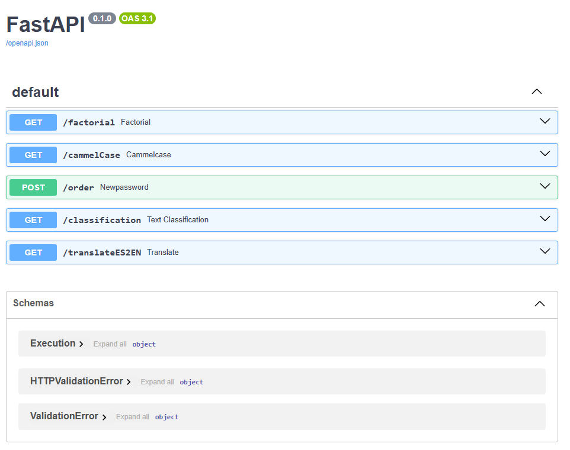

Los 3 primeros no tienen pipelines:

### Factorial

Obtiene el factorial dado por un número de entrada:

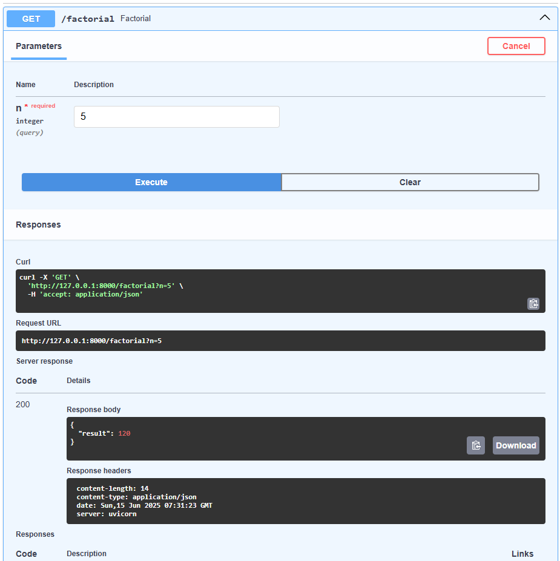

### Camelcase

Se obtiene el camelcase de un texto para programar más bonito:

### Orders!

App donde el Imperio ejecuta sus órdenes:

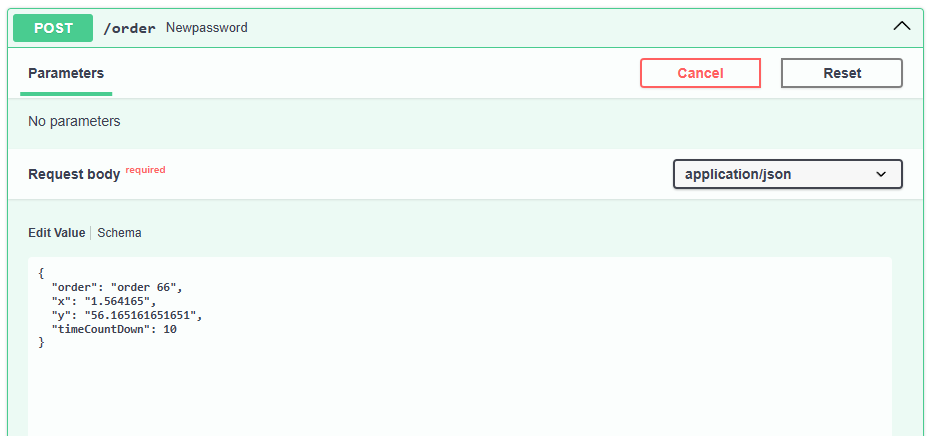 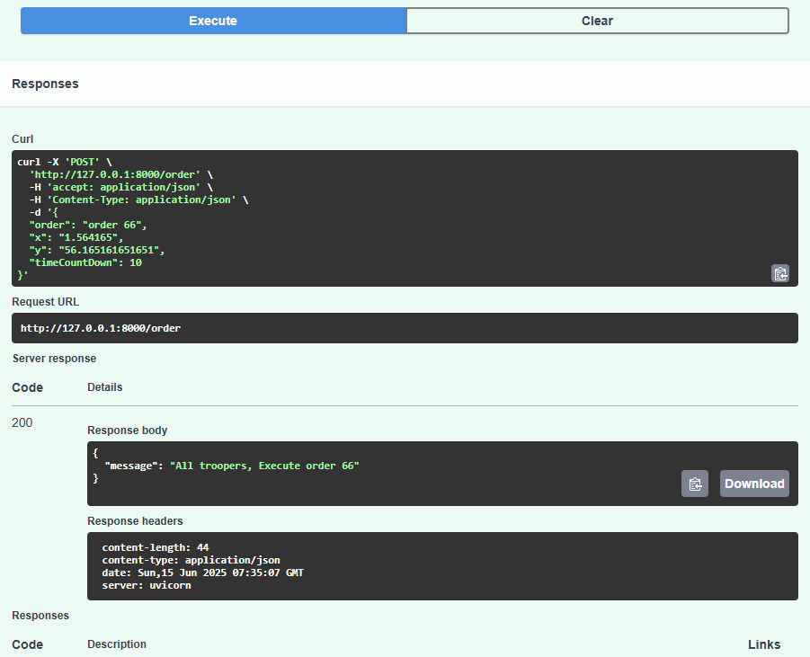

### Classification

En un toque de increíble originalidad, en vez de dar sentimiento se clasifica si un comentario es positivo o negativo.

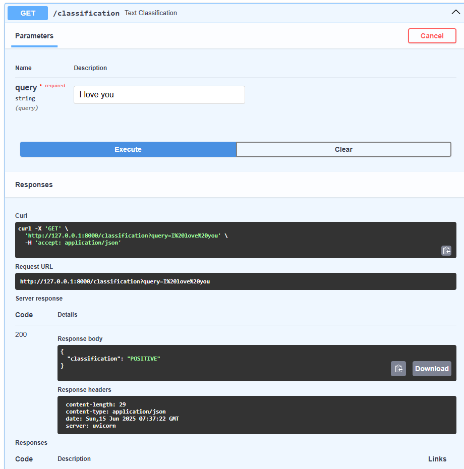

### Translate Español to English

Con un poco más de cariño y después de una larga búsqueda de buenos modelos pequeños, dejo un pequeño traductor de español a inglés.

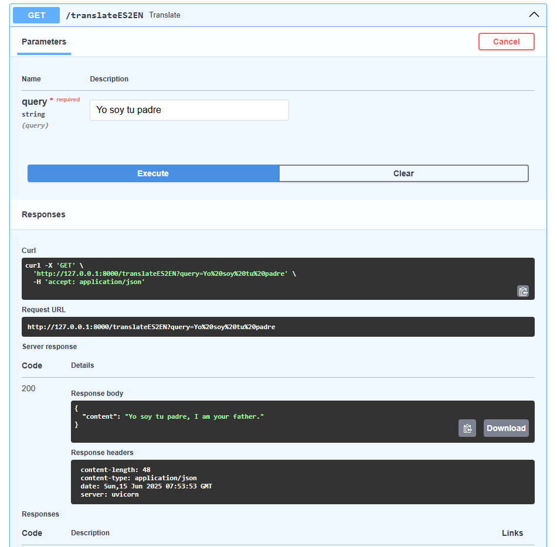

### Cloud RUN

Después de muchos intentos y pruebas en local he logrado desplegar estos servicios en Google Cloud Run, adjunto evidencias:

* Primero los Docs:

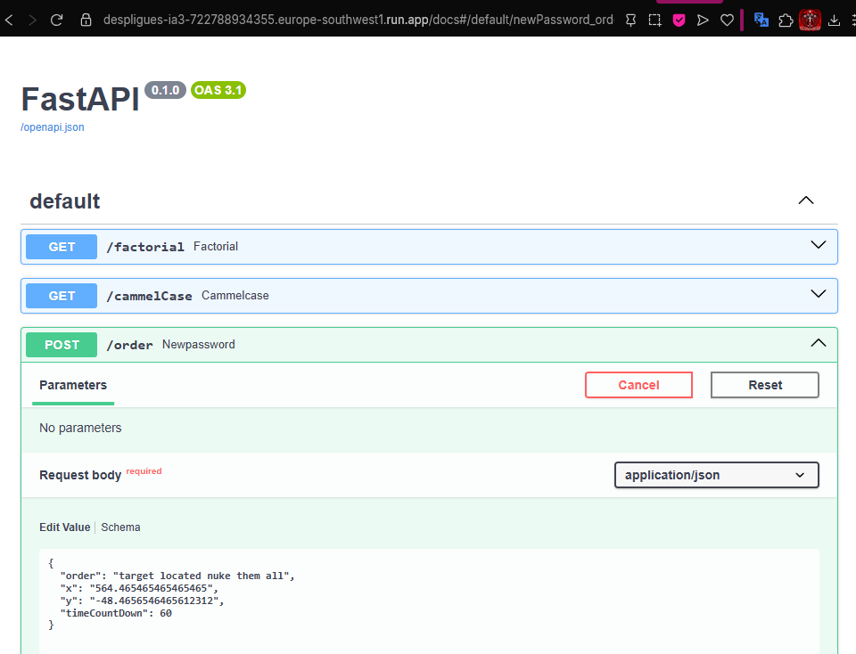 

* Muestro los logs de éxito:

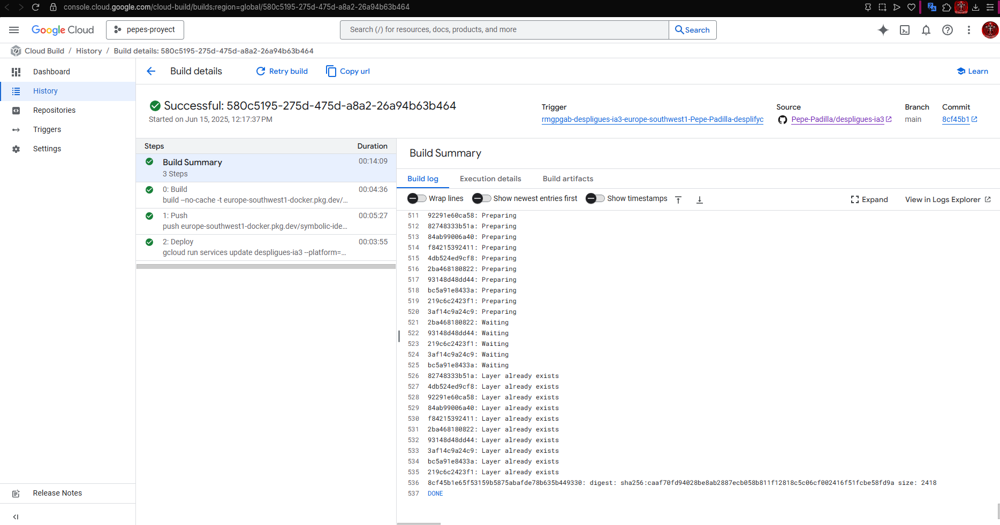

* El historial de intentos:

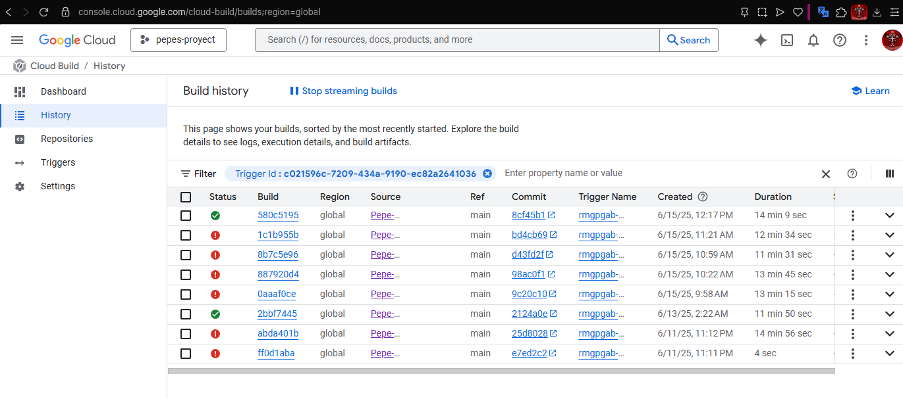

* La feliz consola de haberlo instalado después de varios intentos:

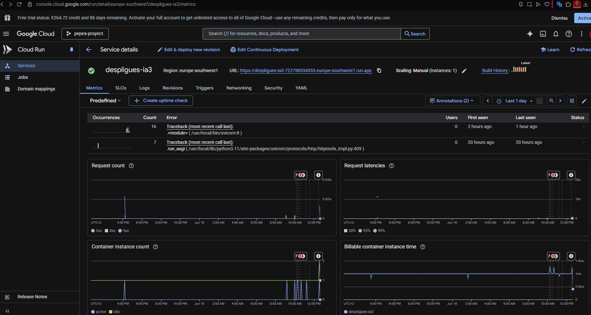

* Al final, para que no me cobren en el futuro, lo eliminé 😭

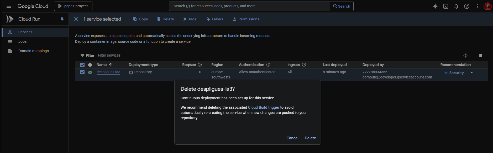

RIP

## Conclusiones finales

He aprendido mucho y considero de gran importancia este módulo, que será un gran diferencial ante otras personas saber y entender todos estos pasos. Considero muy relevante la experiencia que he tenido y enriquecedora la experiencia con Google Cloud (solo había trabajado con AWS).

Si tuviera más tiempo le hubiera dado más amor a los modelos de ML para que dieran mejores resultados, y entregado mejores APIs con más ejemplos y consultas más interesantes.

Me quedo con mucho amor a todas las nuevas herramientas que he aprendido.
