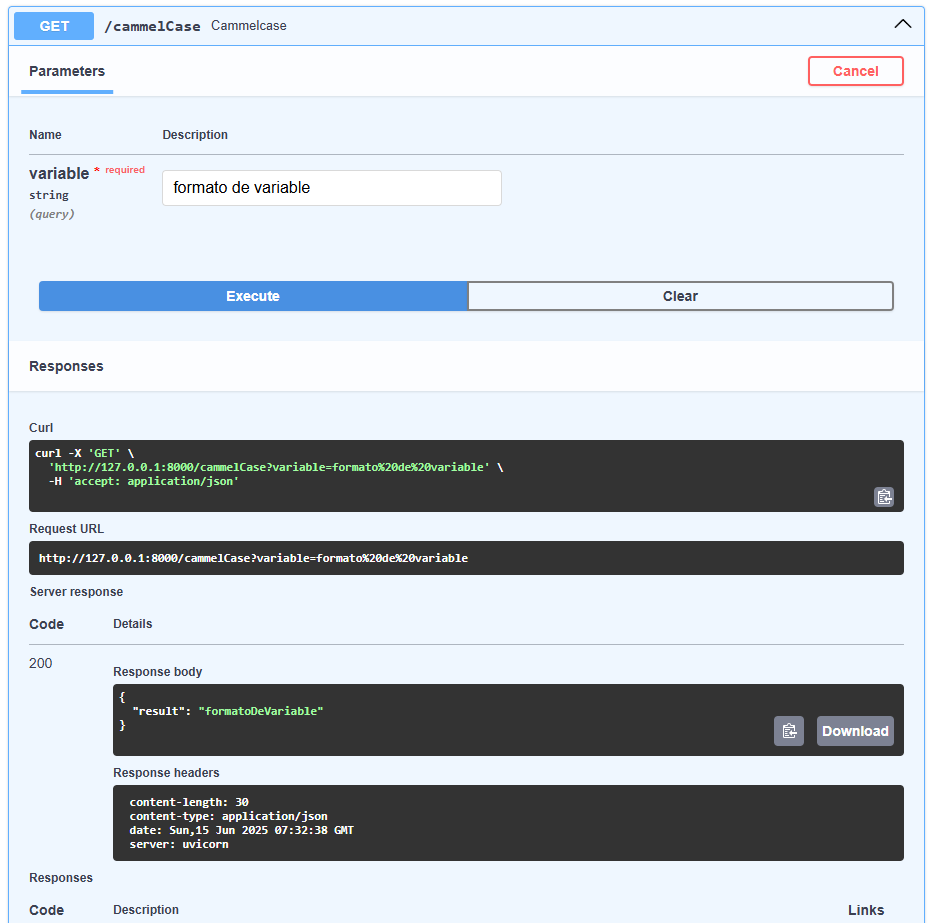
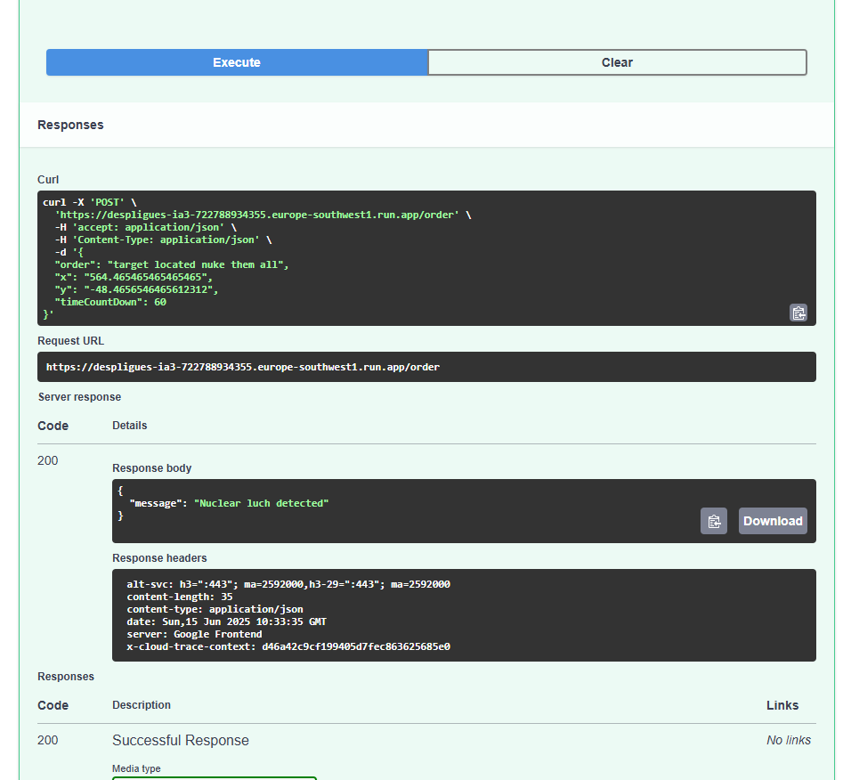

# despligues-ia3
>> Despliegues Algoritmos Clase
Proyecto para master bootcamp IA3 del modulo Despliegues MLOps 

Este proyecto es un entregable para la práctica del Master Bootcamp Inteligencia Artificial Full Stack Edición III realizado por el centro de formación [@Keepcoding](https://github.com/KeepCoding)

[Concluciones](#conclusiones)

---
## ML Flow FTW

El contendio de esta parte de la práctica esta explicado y ejecutado en [MyFlow.ipynb](./mlFlow/MyFlow.ipynb), ahí se puede ver el proceso, resultado, evidencias y concluciones de esta parte de la práctica.

## Fast API

Se ha contrudido los 5 módulos de llamdas:

Los 3 primeros no tienen pipelines:

### Factorial
Obtiene el factorial dado por un número de entrada:

### Camelcase
Se obtiene el camelcase de un texto para programar más bonito:

### Orders!
App donde el imperio ejecutas sus ordenes!
 

### Clasification
En un toque de increible originalidad, en vez dar sentimiento se clasifica si un comentario es positivo o negativo.

### Translate Español to English
Con un poco más de cariño y despues de una larga busqueda de buenos modelos pequeños, dejo un pequecho traductor de español a ingles.

### Cloud RUN
Después de muchos intentos y pruebas en local he logrado desplegar estos servicios en el Google Cloud Run, adjunto evidencias:

- Primero los Docs:
   

- Muestro los logs de éxito:
  

- El historial de intentos:
  

- La feliz consola de haber instalado después de varios intentos:
  

- Al final, para que no me cobren en el futuro lo elimine 😭
  
  RIP